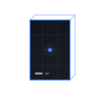

<table border="0">
  <tr>
    <td width="200" align="center" valign="top">
      
    </td>
    <td valign="top">
      <h1>MonolithUI</h1>
      <p><strong>Industrial design system</strong><br/>
      <em>Built for developer tools, orchestration scripts, and CLIs.</em></p>
      <p>
        
        <a href="LICENSE"></a>
        
        
      </p>
    </td>
  </tr>
</table>

---

## Overview

MonolithUI provides a design system for graphical and terminal interfaces.

The system uses **React 19**, **TypeScript**, and **Phosphor Icons**. It defines interfaces via semantic CSS custom properties. Branding requires overriding variables in the `@layer brand` CSS layer.

---

## Principles

- **Density:** Every element serves a functional purpose.
- **Physics:** Motion uses bezier curves or spring physics to emulate momentum.
- **Terminal Compatibility:** Components translate to 16-color TUI environments using box-drawing characters and ANSI sequences.
- **Layout:** Content occupies the primary canvas. Command bars, docks, and drawers orbit the central view.
- **Tokens:** Semantic token slots (`--ui-*`) define structure, while brand tokens (`--brand-*`) define color.

---

## Token System

A 7-step greyscale surface ramp provides the structural foundation. Surfaces remain greyscale; brand tint applies only via `--brand-*` accent tokens.

```css
--ui-surface-0: #080808  /* Backdrops */
--ui-surface-1: #0f0f0f  /* Navigation, Sidebars */
--ui-surface-2: #161616  /* Secondary Panels */
--ui-surface-3: #1e1e1e  /* Root Canvas */
--ui-surface-4: #262626  /* Cards, Drawers */
--ui-surface-5: #303030  /* Hover states */
--ui-surface-6: #3a3a3a  /* Active states */
```

Elevated elements use a triple-stack shadow pattern:

```css
box-shadow: var(--ui-edge-light), var(--ui-shadow-*), var(--ui-inset-*);
```

Full token reference: [`skill/monolith-ui.skill/SKILL.md`](skill/monolith-ui.skill/SKILL.md)

---

## Brand Presets

Apply presets via a class on the `<html>` element:

| Class | Primary | Secondary | Character |
|---|---|---|---|
| `brand-plasma-core` | `#22d3ee` | `#a855f7` | Reference implementation |
| `brand-oxidized-gold` | `#f59e0b` | `#fbbf24` | Industrial warmth |
| `brand-violet-reaction` | `#a855f7` | `#e11d48` | High-voltage |
| `brand-coolant-liquid` | `#06b6d4` | `#2dd4bf` | System process |
| `brand-critical-mass` | `#ef4444` | `#991b1b` | Alert state |

Presets define surface ramps, accent scales, and gradients. Enable light theme with `data-theme="light"`.

---

## Installation

```bash
git clone https://github.com/julesklord/MonolithUI.git
cd monolith-ui
npm install
npm run dev
```

Build for production:

```bash
npm run build
```

---

## Agent Integration

The [`skill/monolith-ui.skill/SKILL.md`](skill/monolith-ui.skill/SKILL.md) file provides component patterns, motion rules, and layout guidelines for AI agents.

To use with Gemini CLI:

```bash
gemini --skill skill/monolith-ui.skill/SKILL.md
```

---

## License

<p align="center">
  Engineered by <a href="https://github.com/julesklord">julesklord</a>.<br>
  Released under the MIT License.
</p>
